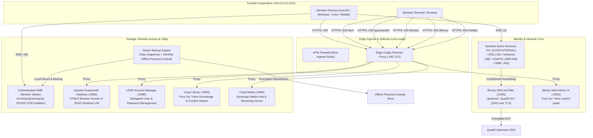

# Tech Coop Framework — Engineering Portfolio & Case Study

> **A homelab-first technology cooperative platform:** Useful, self-hosted services running on owned hardware, engineered with rigorous operational discipline so any member or steward can maintain, verify, and recover them.

---

> 🌐 **Interactive Showcase & Architecture Explorer:**  
> **[https://linuxjourney.github.io/tech-coop-showcase/](https://linuxjourney.github.io/tech-coop-showcase/)**  
> *Features a live solar lighting engine (auto-transitions light/dark at dawn/dusk), interactive 3-perspective viewer (Stakeholder, Architecture, Reliability), and dynamic topology maps.*

---

## Executive Summary

| Attribute | Details |
|---|---|
| **Mission** | Digital sovereignty, collective data ownership, and self-hosted infrastructure for small cooperatives and communities. |
| **Philosophy** | **Homelab-first:** Prove viability on owned physical hardware before expanding to public cloud infrastructure. |
| **Current Status** | Working production foundation on single-node hardware (`core-node`). First member transaction complete. |
| **Core Architecture** | Samba4 Active Directory Domain Controller, Kerberos, Restic automated backups, Apache Guacamole HTML5 gateway, Blocky DNS filtering, pure-Go/htmx micro-utilities, edge Caddy TLS reverse proxy. |
| **Operational Health** | **19/19 automated health checks passing continuously.** See [docs/health-check.sh](docs/health-check.sh). |
| **Reliability Artifacts** | Append-only operations log (~2,000 lines), 14 production runbooks, architectural decision records (ADRs), and battle-tested failure recovery procedures. |
| **Runtime Efficiency** | **Zero production Node/npm runtime overhead.** All authored services run as statically compiled pure Go binaries (`CGO_ENABLED=0`) with vendored vanilla htmx. |

---

## 1. The Challenge & Architectural Pivot

### The Pitfall: Premature Complexity (v0)
Earlier explorations of this cooperative platform fell into the trap of premature scaling:
- **Eleven pre-declared IT departments** with roughly thirty interlocking contracts were written before a single real user ever used the system.
- Built as a heavy Turborepo monorepo with React, Vite, Hono, and Authentik.
- Because boundaries were defined as a theoretical partition of a whole, no service could evolve without renegotiating its neighbors, which collapsed under documentation weight and ceremonial paperwork.
- **The fatal flaw:** Governance and legal questions were fused directly into code before validating a single real person's need.

### The Pivot: The Rebuild Brief (v1)
In September 2026, the project underwent a disciplined reboot guided by [docs/rebuild-brief.md](docs/rebuild-brief.md):
1. **Discover modules from real working needs** rather than abstract taxonomy.
2. **Homelab-first validation:** Prove real utility on a single physical machine (compact x86-64 mini-PC server) on the local LAN before multi-node complexity.
3. **The First Transaction:** Validate the stack against one tangible outcome: *a second cooperative member successfully authenticating and storing private files on an isolated share.*
4. **Runbook before automation:** Every automated service must have a human-executable written runbook first.
5. **Rigorous Definition of Done (Rule 9):** Every module must ship with installation, backup, verified restore, health check signal, and at least one documented failure recovery procedure. See [docs/sample-runbook.md](docs/sample-runbook.md).

---

## 2. System Architecture



---

## 3. Core Subsystems & Technical Implementation

### 3.1. Active Directory Identity & Access Management
- **Engine:** Samba 4 configured as an Active Directory Domain Controller (`COOP.INTERNAL`).
- **Protocols:** Native Kerberos kinit/klist authentication, LDAP/LDAPS, DNS server with dynamic updates.
- **Least-Privilege Administration:**
  - Designed the `svc-lam` service account restricted strictly to the built-in `Account Operators` group.
  - Enables routine member onboarding and password resets via **LDAP Account Manager (LAM)** at `/lam/` without exposing Domain Admin credentials or requiring SSH terminal access.
  - See [docs/design-lens.md](docs/design-lens.md) for how the cooperative balances member simplicity with steward toil.

### 3.2. Secure Member File Storage & Strict DAC Isolation
- **Storage Layer:** POSIX file shares with Samba extended ACLs.
- **Privacy Trust Boundary:** Each member's personal directory (`/srv/share/{username}`) is locked down to mode `0700` (`drwx------`) owned by the individual member UID.
- **First Real Transaction Verified:** A second physical member verified connecting over SMB from macOS, authenticating via Kerberos, and writing files while maintaining complete cross-member isolation from other member folders.

### 3.3. Restic Backup System & Verified Disaster Recovery
- **Automation:** Systemd timer triggers automated incremental deduplicated restic snapshots to `/var/backups/samba`.
- **Scope:** Complete file-share recovery scope covering member storage (`/srv/share`), Samba AD DC state (`/var/lib/samba`), and configuration manifests.
- **Custodian Model:** Primary Systems Steward designated as external physical drive custodian with monthly offline rotation.
- **Verified Restore Drill:** Proved full restore in an isolated test environment (verified directory state, Kerberos keytabs, and database integrity without corrupting the production host).
- **Steward Self-Service:** Standalone CLI tool `/usr/local/bin/coop-backup` and read-only SMB `[backups]` mount for instant point-in-time file recovery.

### 3.4. Network Defense & DNS Ad-Filtering
- **Topology:** Client devices query Samba AD DNS (`10.0.0.10:53`) for internal resolution; external queries forward to **Blocky** (`:5335`), which filters advertising/tracking domains and forwards to **Quad9 via DNS over TLS (DoT)**.
- **Fail-Open Resilience:** If the DNS filtering service fails, Samba DNS automatically bypasses it, preventing network-wide outages.
- **Bespoke Control Interface:** Author authored `blocky-ui`, a lightweight, dependency-free Go/htmx control daemon (listening on `127.0.0.1:9090`) with rate limiting, Origin verification, and 1m/5m/15m/1h temporary disable controls.

### 3.5. Coop Library — Dumb Terminal Content & Knowledge Utility
- **Concept:** Client browsers act as a pure rendering surface ("dumb terminal"); the local server handles token indexing, CommonMark rendering, and HTTP byte-range streaming.
- **Earthy Aesthetic & Solar Lighting Engine:**
  - Built-in astronomical solar algorithm calculates local sunrise and sunset from timezone coordinates.
  - Automatically transitions between warm unbleached linen (Light mode) and rich peat loam (Dark mode) at dawn and dusk with zero layout shift or FOUC.
  - Tactile, organic color palette (linen, limestone, terracotta pottery, forest moss, charred oak) designed for low eye strain and long reading sessions.
- **Markdown Architecture:** Powered by `github.com/yuin/goldmark` (pure Go standard library). Features GFM tables, flowing paragraph typography, interactive task lists, and automatic in-reader cross-document link rewriting.

### 3.6. Coop Media — Sovereign Content Server & Hub (Sun Ray Model)
- **Concept:** Solves member photo, video, and audio sprawl on owned NVMe storage without relying on Spotify, YouTube, iCloud, or heavy container constellations. Implements the *Smart Server, Stateless Edge (Sun Ray)* architectural pattern.
- **Zero Edge Toil:** Members deposit media using standard OS tools over SMB (`//core-node.coop.internal/share/media`) into `photos/`, `videos/`, and `music/` from macOS Finder, Windows File Explorer, or iOS/Android Files apps without requiring custom background sync daemons.
- **Server Compute Density:** Daemon runs as a pure-Go static binary (`127.0.0.1:9096`) extracting EXIF camera metadata, ID3v2/Vorbis music tags, computing responsive JPEG/WebP thumbnails on-demand to `/var/cache/coop-media`, and streaming videos and audio via HTTP 206 byte-ranges.
- **Durable Metadata & Tagging:** User-assigned metadata, tags, and custom artwork are persisted safely in `/var/lib/coop-media/metadata/` without touching read-only member files, backed up daily via restic.
- **Strict DAC Boundary:** Sandboxed in systemd with `ProtectSystem=strict` and POSIX mode `2775`, preventing access to mode `0700` private member home shares. Full runbook in [docs/sample-runbook.md](docs/sample-runbook.md).

---

## 4. Operational Maturity & Reliability

### Automated Health Signaling (19/19 Passing)
Every critical subsystem is integrated into an automated verification harness ([docs/health-check.sh](docs/health-check.sh)):

```bash
PASS: samba-ad-dc is active
PASS: smbd is disabled (AD DC internal smb active)
PASS: port 53 is listening (DNS)
PASS: port 88 is listening (Kerberos)
PASS: port 389 is listening (LDAP)
PASS: port 445 is listening (SMB)
PASS: port 636 is listening (LDAPS)
PASS: samba-tool dbcheck (0 database errors)
PASS: internal DNS resolves core-node.coop.internal
PASS: external DNS resolves via forwarder
PASS: blocky is active
PASS: DNS ad-filtering active (doubleclick.net -> 0.0.0.0 via Samba->Blocky)
PASS: /srv disk usage under 90% (currently 23%)
PASS: /var/backups/samba disk usage under 90% (currently 1%)
PASS: ufw is active
PASS: coop-library is active
PASS: coop-library health endpoint reports ok
PASS: coop-media is active
PASS: coop-media health endpoint reports ok
Summary: 19 passed, 0 failed
```

### The Append-Only Operations Log
Every system change, configuration tweak, installation, and incident is recorded in an immutable, append-only log with strict schema:
- `WHO`: Author and Agent roles.
- `WHAT`: Concise action summary.
- `DETAIL`: Step-by-step technical implementation.
- `WHY`: Motivation linked to rebuild brief principles.
- `RESULT`: Observable pass/fail evidence.

The operations log spans **nearly 2,000 lines**, providing an audit trail that eliminates guesswork for incoming stewards.

---

## 5. Engineering Discipline in Practice: Incident Postmortem Case Study

True systems engineering is demonstrated when things break. During the deployment of the Coop Library, a real security incident occurred and was resolved with total transparency:

### The Incident
- **Observation:** Private photos and documents from member personal shares were visible in the newly deployed web library without authentication.
- **Root Cause Analysis:**
  1. Member folders were mode `0700` owned by individual member UIDs.
  2. To allow the unprivileged `coop-library` user to read public documentation, `AmbientCapabilities=CAP_DAC_READ_SEARCH` had been granted in the systemd service file.
  3. `SHARE_ROOT` was set to `/srv/share`, causing the service to recursively index personal member shares.
  4. The process's Linux capability bypassed POSIX DAC permissions, exposing private member files over unauthenticated LAN HTTP.
- **Immediate Containment:**
  - Stripped `SHARE_ROOT` and revoked `CAP_DAC_READ_SEARCH` from systemd within minutes.
  - Restricted service filesystem scope exclusively to `/opt/coop-docs`.
- **Codebase Hardening & Prevention:**
  - Hardcoded an explicit security refusal in Go: daemon strictly rejects any attempt to scan `/srv/share`.
  - Added automated regression unit tests in `main_test.go` ensuring empty default share roots and rejection of multi-user trees.
  - Codified the lesson in [docs/patterns.md](docs/patterns.md): *"Never use CAP_DAC_READ_SEARCH or root privilege to bypass member storage isolation in unauthenticated services."*

---

## 6. Architectural Decision Records (ADRs)

| ADR | Decision | Rationale |
|---|---|---|
| **ADR 0001** | Uniform Module Interface (`/ui/*` and `/api/*`) | Predictable reverse proxy routing and unified human/machine observability across all micro-services. |
| **ADR 0002** | Identity Backend: Samba4 Active Directory DC | Provides enterprise-grade Kerberos authentication, POSIX ACL mapping, and native client compatibility without SaaS dependencies. |
| **ADR 0003** | Remote Desktop Administration Gateway | Apache Guacamole HTML5 gateway into Windows RSAT VM with pinned TLS certificates, enabling full graphical AD administration from any web browser. |
| **ADR 0004** | Platform Stack: Pure Go + Statically Vendored HTMX | Eradicates Node/npm production fragility, build toolchains, and CDN failures. Single static binaries (`CGO_ENABLED=0`) deployed via systemd. |

---

## 7. Showcase Repository & Privacy Boundary

This repository is a **curated, public engineering showcase** designed to illustrate the architectural principles, operational rigor, and reliability practices of the Tech Coop Framework.

To protect member privacy and live home infrastructure:
- **Private Production Repository:** The complete operational repository (containing live host configuration files, local subnet bindings, domain certificates, and private member histories) remains strictly private.
- **Zero-Secret Public Showcase:** This repository contains standalone architectural specifications, the interactive web showcase, verified runbooks, and sanitised operational artifacts demonstrating production-grade reliability without exposing live infrastructure secrets.

---

*Tech Coop Framework • Designed, engineered, and maintained for cooperative digital autonomy.*
